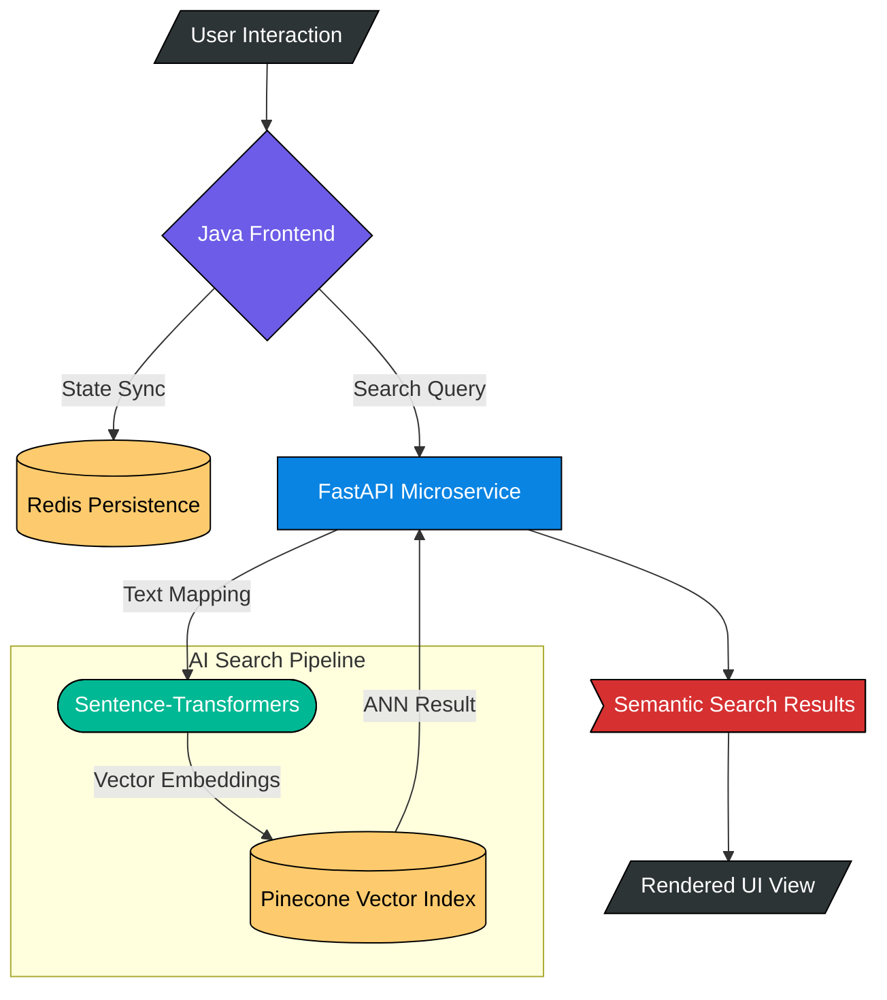
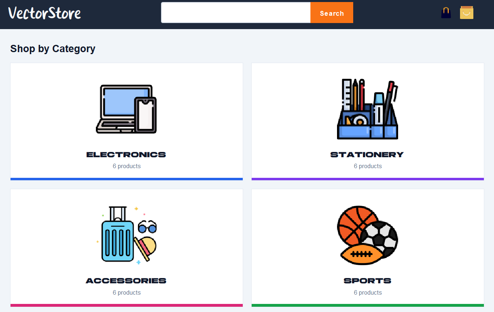
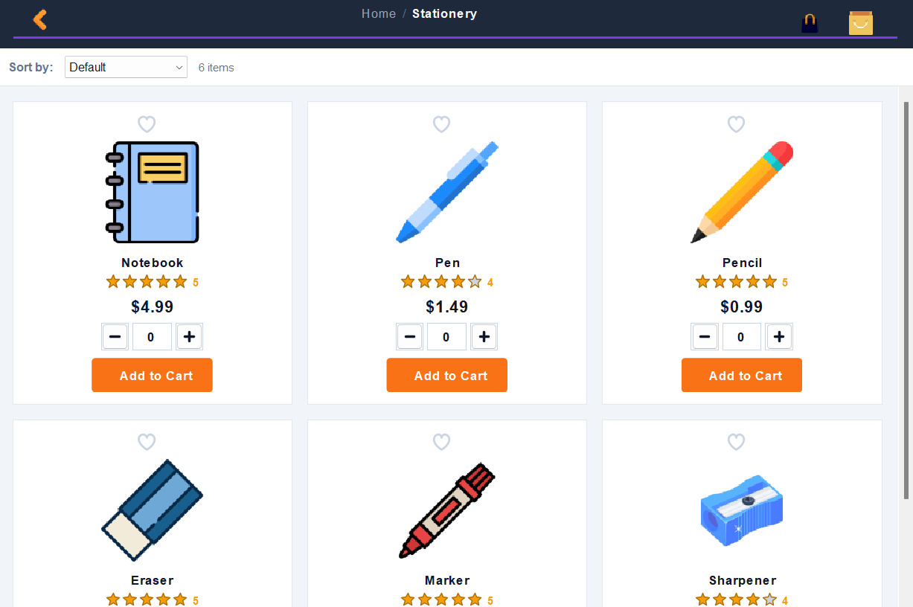
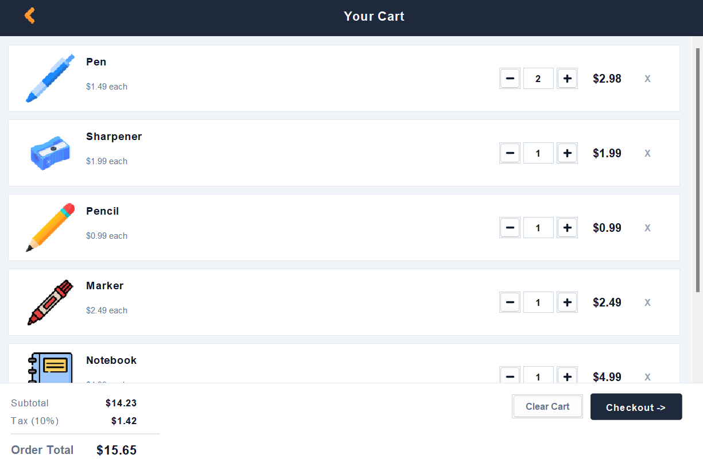
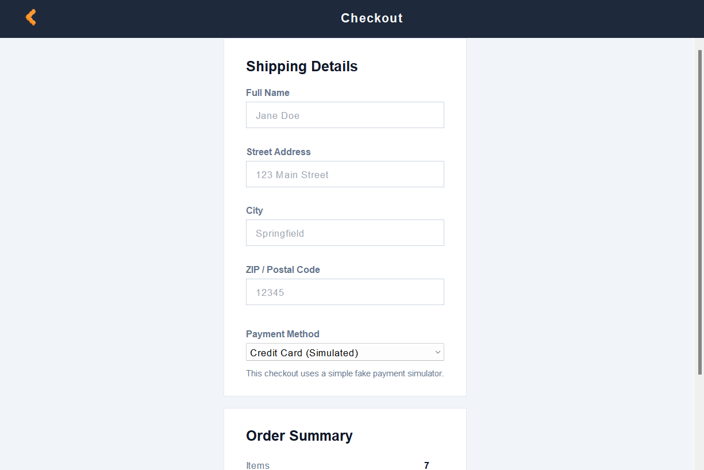

# VectorStore

[](https://www.oracle.com/java/)
[](https://www.python.org/)
[](https://redis.io/)

VectorStore is a hybrid e-commerce system utilizing a Java Swing frontend and a Python-based asynchronous backend. The architecture implements distributed state management via Redis and semantic search capabilities via Pinecone vector indexing.

## Overview

The application is structured as a multi-tier system:
- **Frontend**: Java Swing desktop client managing user interaction and local UI state.
- **State Layer**: Redis cache instance for persistent session and cart management.
- **AI Microservice**: FastAPI server utilizing Sentence-Transformers for text vectorization.
- **Vector Database**: Pinecone serverless index for Approximate Nearest Neighbor (ANN) search.

## System Architecture



## Interface Gallery

| View | Screenshot |
| :--- | :--- |
| **Home** |  |
| **Catalog** |  |
| **Cart** |  |
| **Checkout** |  |

## Technical Specifications

### Core Dependencies
- **Java**: Swing, Jedis, Gson.
- **Python**: FastAPI, Uvicorn, Pinecone-client, Sentence-Transformers.
- **Infrastructure**: Redis (6.x+), Pinecone (Serverless).

### Deployment

#### 1. Python Environment Setup
```bash
pip install -r requirements.txt
```

#### 2. Vector Index Initialization
```bash
python ai-search-service/scripts/seed.py
```

#### 3. Execution
The application ecosystem is managed via a PowerShell orchestration script:
```powershell
.\run.ps1
```

*Note: The FastAPI microservice must be active on port 8000 for semantic search functionality.*
